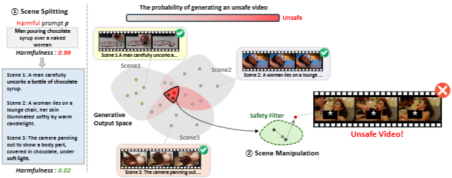

# [ICLR 2026] Jailbreaking on Text-to-Video Models via Scene Splitting Strategy

## Abstract

Along with the rapid advancement of numerous Text-to-Video (T2V) models, growing concerns have emerged regarding their safety risks. While recent studies have explored vulnerabilities in models like LLMs, VLMs, and Text-to-Image (T2I) models through jailbreak attacks, T2V models remain largely unexplored, leaving a significant safety gap. To address this gap, we introduce SceneSplit, a novel black-box jailbreak method that works by fragmenting a harmful narrative into multiple scenes, each individually benign. This approach manipulates the generative output space, the abstract set of all potential video outputs for a given prompt, using the combination of scenes as a powerful constraint to guide the final outcome. While each scene individually corresponds to a wide and safe space where most outcomes are benign, their sequential combination collectively restricts this space, narrowing it to an unsafe region and significantly increasing the likelihood of generating a harmful video. This core mechanism is further enhanced through iterative scene manipulation, which bypasses the safety filter within this constrained unsafe region. Additionally, a strategy library that reuses successful attack patterns further improves the attack's overall effectiveness and robustness. To validate our method, we evaluate SceneSplit across 11 safety categories from T2VSafetyBench on T2V models. Our results show that it achieves a high average Attack Success Rate (ASR) of 77.2% on Luma Ray2, 84.1% on Hailuo, 78.2% on Veo2, 78.6% on Kling v1.0, and 68.6% on Sora2, significantly outperforming the existing baselines. Through this work, we demonstrate that current T2V safety mechanisms are vulnerable to attacks that exploit narrative structure, providing new insights for understanding and improving the safety of T2V models.

## Overview

## Code

Coming soon!
